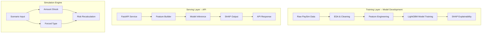

# Adaptive Risk Twin – Fraud Detection MVP (Phase 1)

Real-time fraud scoring • What-if simulation • Explainable ML • FastAPI • Docker • CI/CD

This repository contains Phase 1 of the Adaptive Risk Twin, a fraud detection engine that scores transactions in real time, provides explainability, and supports what-if simulations to test extreme financial scenarios.

## Key Business Impact

- Detects high-risk transactions instantly → reduces financial losses  
- Supports “what-if” simulations (amount shocks, type changes) → helps risk teams understand edge cases  
- Offers explainability (SHAP) → improves trust, governance, and audit readiness  
- CI/CD pipeline ensures reliability and production readiness  

## Technical Overview

- **Data ingestion:** PaySim dataset (optionally from S3)  
- **Feature engineering:** balance drop ratios, jump ratios, zero-to-zero, unchanged balance  
- **Model:** LightGBM (handles imbalance, fast inference)  
- **Explainability:** SHAP value computation  
- **API:** FastAPI microservice  
- **Containerization:** Docker  
- **CI/CD:** GitHub Actions  

## System Architecture



## Project Structure

```
Adaptive_Risk_Twin/
│── src/
│   ├── api/paysim_api.py
│   ├── train/paysim_train_fraud_model.py
│   └── dashboard/
│── models/lgbm_fraud.txt
│── data/processed/paysim_cleaned_core_features.csv
│── tests/
│── Dockerfile
│── requirements.txt
│── README.md
```

## How to Run Locally

1. Create venv  
   ```
   python -m venv .venv
   .venv/Scripts/activate
   ```
2. Install dependencies  
   ```
   pip install -r requirements.txt
   ```
3. Run API  
   ```
   uvicorn src.api.paysim_api:app --reload
   ```
4. Optional:  
   ```
   streamlit run src/dashboard/app.py
   ```

## CI/CD Pipeline

- Installs dependencies  
- Runs Black formatter  
- Executes unit tests  
- Blocks merge if anything breaks  

## Roadmap

**Phase 1 (Current):**  
EDA • Feature Engineering • LightGBM • SHAP • FastAPI • Simulation • Docker • Unit Tests • CI/CD  

**Phase 2 (Future):**  
Credit model • Liquidity forecasting • Operational risk • Multi-agent coordination • Streaming • Enterprise dashboard  

## Contact

**Moras Kashyap**  
LinkedIn: https://www.linkedin.com/in/moras-kashyap/  
GitHub: https://github.com/moras11  
