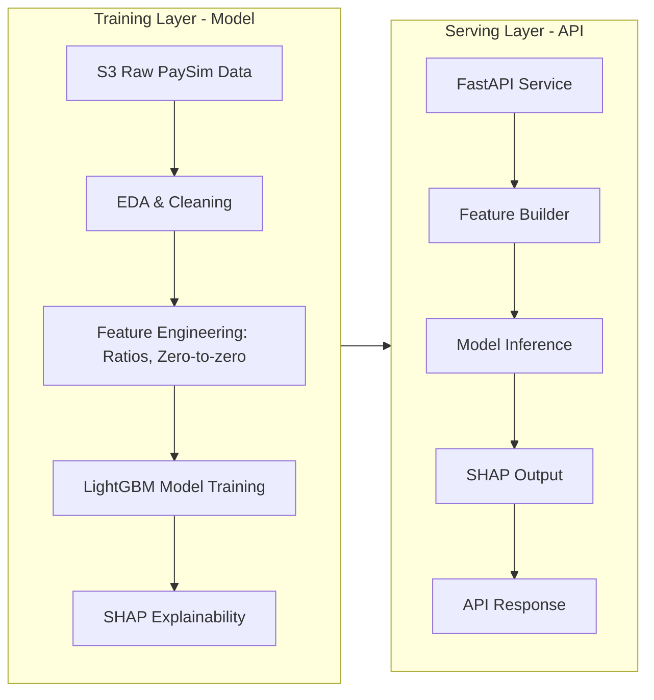

# Adaptive Risk Twin – Fraud Detection MVP (Phase 1)

A production-ready fraud scoring + simulation engine with explainable ML, CI/CD, and API containerization.

---

## 1. Business Impact

- Detects high‑risk transactions in real time → reduces financial losses  
- Runs what‑if simulations (amount shock, type change) → supports extreme‑case risk analysis  
- Provides explainability (SHAP) → improves audit readiness & governance  
- CI/CD ensures reliability, consistency, and deployment safety  

---

## 2. Technical Overview

### ✔ S3-based Data Ingestion  
### ✔ EDA → Feature Engineering → LightGBM Model  
### ✔ SHAP Explainability  
### ✔ FastAPI Microservice  
### ✔ What‑if Simulation Engine  
### ✔ Dockerized Deployment  
### ✔ GitHub Actions CI Pipeline  

---

## 3. System Architecture



---

## 4. Project Structure

```
Adaptive_Risk_Twin/
│── src/
│   ├── api/
│   │   └── paysim_api.py
│   ├── train/
│   │   └── paysim_train_fraud_model.py
│   ├── dashboard/
│   │   └── app.py   (Streamlit - Phase 1.5)
│── data/
│   └── processed/
│       └── paysim_cleaned_core_features.csv
│── models/
│   └── lgbm_fraud.txt
│── tests/
│   ├── test_feature_engineering.py
│   └── test_predict_endpoint_mock.py
│── Dockerfile
│── requirements.txt
│── README.md
│── progress_log.md
```

---

## 5. How to Run Locally

### 1. Create venv  
```
python -m venv .venv
.venv/Scripts/activate     # Windows
```

### 2. Install requirements  
```
pip install -r requirements.txt
```

### 3. Run API  
```
uvicorn src.api.paysim_api:app --reload
```

### 4. (Optional) Run Dashboard  
```
streamlit run src/dashboard/app.py
```

---

## 6. CI Pipeline (GitHub Actions)

- Installs Python dependencies  
- Runs Black formatter  
- Executes 4 unit tests  
- Rejects merge if anything breaks  

---

## 7. Roadmap

### Phase 1 (Fraud Module)  
✔ EDA  
✔ Feature Engineering  
✔ LightGBM  
✔ SHAP  
✔ FastAPI  
✔ Simulation  
✔ Docker  
✔ Unit Tests  
✔ CI Pipeline  
⧗ Streamlit Dashboard (in progress)  

### Phase 2 (Full Adaptive Risk Twin)
- Credit Model  
- Liquidity Forecasting  
- Operational Risk Rules  
- Multi-Agent Coordination Layer  
- Risk Knowledge Graph  
- Kafka Real‑time Streaming  
- Enterprise Dashboard (Plotly / Streamlit Pro)

---

## Contact  
**Moras Kashyap – Machine Learning & Data Science**  
LinkedIn: https://www.linkedin.com/in/moras-kashyap/  
GitHub: https://github.com/moras11
